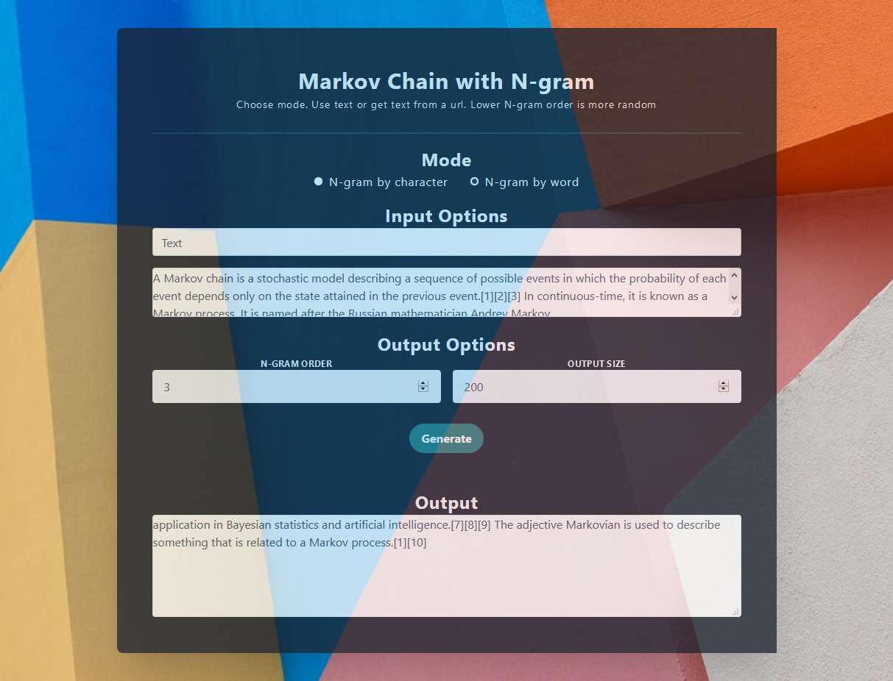

# Markov Chain

An example of Markov Chain with N-gram displayed build using Vue.js and Tailwindcss

> A Markov chain is a stochastic model describing a sequence of possible events in which the probability of each event depends only on the state attained in the previous event.[1][2][3] In continuous-time, it is known as a Markov process. It is named after the Russian mathematician Andrey Markov. 
> - [Wikipedia](https://en.wikipedia.org/wiki/Markov_chain)

### Credits
- https://shiffman.net/a2z/markov